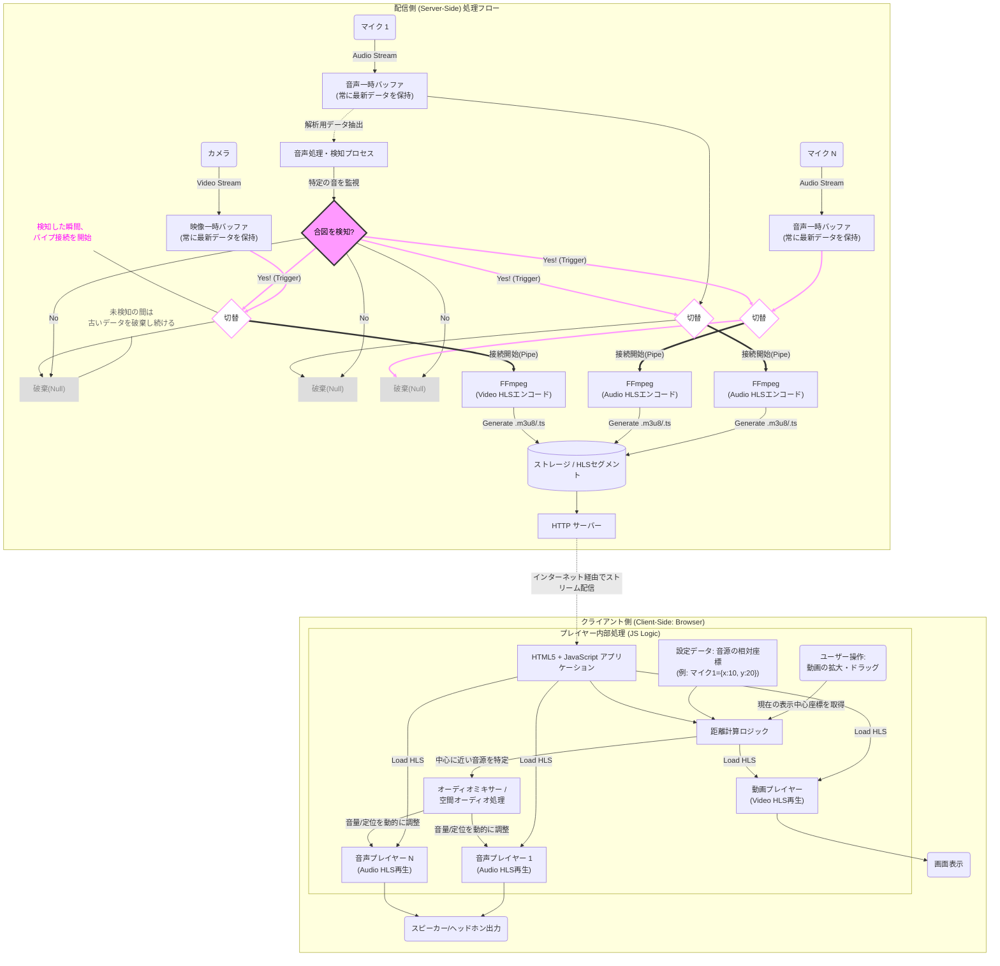
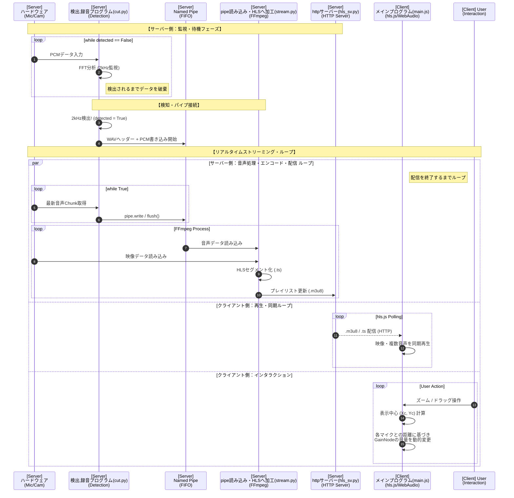

---
config:
  layout: dagre
---
flowchart LR
 subgraph subgraph00["追加のマイク"]
        A_BUFN["音声一時バッファ (常に最新データを保持)"]
        MIC2("マイク N")
        n3["音声処理・検知プロセス FFTで最大振幅をチェック"]
        n2["合図を検知?"]
        SWITCH_A1{"切替"}
        DISCARD_AN["破棄(Null)"]
        FF_A1["FFmpeg (Audio HLSエンコード)"]
  end
 subgraph subGraph0["配信側 (Server-Side) 処理フロー"]
        subgraph00
        A_BUF1["音声一時バッファ (常に最新データを保持)"]
        MIC1("マイク 1")
        V_BUF["映像一時バッファ (常に最新データを保持)"]
        CAM("カメラ")
        A_PROC["音声処理・検知プロセス"]
        DETECT{"合図を検知?"}
        DISCARD_V["破棄(Null)"]
        note_discard["未検知の間は 古いデータを破棄し続ける"]
        DISCARD_A1["破棄(Null)"]
        SWITCH_V{"切替"}
        note_connect["検知した瞬間、 パイプ接続を開始"]
        FF_A2["FFmpeg (Audio HLSエンコード)"]
        FF_V["FFmpeg (Video HLSエンコード)"]
        STORAGE[("ストレージ / HLSセグメント")]
        WEB_SRV["HTTP サーバー"]
        n1["合図を検知?"]
        n4["音声処理・検知プロセス"]
        n5["切替"]
  end
 subgraph subGraph1["プレイヤー内部処理 (JS Logic)"]
        V_PLAYER["動画プレイヤー (Video HLS再生)"]
        CLIENT_BROWSER["HTML5 + JavaScript アプリケーション"]
        COORD_DATA["設定データ: 音源の相対座標 (例: マイク1={x:10, y:20})"]
        CALC_DIST["距離計算ロジック"]
        UI_ACTION("ユーザー操作: 動画の拡大・ドラッグ")
        MIXER["オーディオミキサー Gainnode"]
  end
 subgraph subGraph2["クライアント側 (Client-Side: Browser)"]
        subGraph1
        DISPLAY("画面表示")
        SPEAKERS("スピーカー/ヘッドホン出力")
        A_PLAYER1["音声プレイヤー 1 (Audio HLS再生)"]
        A_PLAYERN["音声プレイヤー N (Audio HLS再生)"]
  end
    DETECT -- Yes --> n5
    n2 -- Yes --> SWITCH_A1
    n5 -- 接続開始(Pipe) --> FF_A2
    n3 -- 特定の音を監視 --> n2
    n2 -- No --> DISCARD_AN
    MIC1 -- ストリームで録音 --> A_BUF1
    MIC2 -- ストリームで録音 --> A_BUFN
    CAM -- Video Stream --> V_BUF
    A_BUF1 -. 解析用データ抽出 .-> A_PROC
    A_PROC -- 特定の音を監視 --> DETECT
    DETECT -- No --> DISCARD_A1
    A_BUFN -- 解析用データ抽出 --> n3
    V_BUF --> SWITCH_V
    SWITCH_V --> DISCARD_V
    SWITCH_A1 == 接続開始(Pipe) ==> FF_A1
    SWITCH_V == 接続開始(Pipe) ==> FF_V
    FF_A1 -- "Generate audio*.m3u8/.ts" --> STORAGE
    FF_A2 -- "Generate audio1.m3u8/.ts" --> STORAGE
    FF_V -- "Generate Video.m3u8/.ts" --> STORAGE
    STORAGE --> WEB_SRV
    WEB_SRV -. インターネット経由でストリーム配信 ..-> CLIENT_BROWSER
    UI_ACTION -- 現在の表示中心座標を取得 --> CALC_DIST
    COORD_DATA --> CALC_DIST
    CALC_DIST -- 中心に近い音源を特定 --> MIXER
    MIXER -- 音量/定位を動的に調整 --> A_PLAYER1 & A_PLAYERN
    V_PLAYER --> DISPLAY
    A_PLAYER1 --> SPEAKERS
    A_PLAYERN --> SPEAKERS
    n5 --> DISCARD_A1
    SWITCH_A1 --> DISCARD_AN
    DETECT -- trigger --> SWITCH_V
    CLIENT_BROWSER --> COORD_DATA & COORD_DATA & UI_ACTION
    UI_ACTION -- クロップ --> V_PLAYER

    n3@{ shape: rect}
    n2@{ shape: diam}
    n1@{ shape: diam}
    n4@{ shape: rect}
    n5@{ shape: diam}
    style n2 fill:#f9f,stroke:#333,stroke-width:3px,color:#000
    style SWITCH_A1 fill:#fff,stroke:#f9f,stroke-width:2px
    style DISCARD_AN stroke:none,fill:#ddd,color:#888
    style DETECT fill:#f9f,stroke:#333,stroke-width:3px,color:#000
    style DISCARD_V stroke:none,fill:#ddd,color:#888
    style note_discard stroke:none,fill:none,color:#666
    style DISCARD_A1 stroke:none,fill:#ddd,color:#888
    style SWITCH_V fill:#fff,stroke:#f9f,stroke-width:2px
    style note_connect stroke:none,fill:none,color:#f0f
    style n1 fill:#f9f,stroke:#333,stroke-width:3px,color:#000
    style n5 fill:#fff,stroke:#f9f,stroke-width:2px
    linkStyle 6 stroke:#f9f,stroke-width:3px,fill:none
    linkStyle 7 stroke:#000000,fill:none

ファイル構成をgeminiに入れて作らせた
graph TD
    subgraph "配信サーバー (Python Side)"
        %% 配信プロセス
        MIC(マイク入力) --> CUT["cut.py (FFT分析・2kHz検知)"]
        CAM(カメラ入力) --> STR_V["stream.py -v (FFmpeg HLS)"]

        %% パイプ処理
        CUT -- "検知後、PCMデータを流す" --> PIPE["named pipe (edited_pipe)"]
        PIPE --> STR_A["stream.py -p (FFmpeg HLS)"]

        %% ストレージとサーバー
        STR_V & STR_A --> STORE[("live/ ディレクトリ (.m3u8, .ts)")]
        STORE --> SV["hls_sv.py (HTTPサーバー/CORS対応)"]
    end

    %% 通信
    SV -. "HLSストリーム配信" .-> BROWSER

    subgraph "クライアント (Client Side: JS)"
        BROWSER["ブラウザ (index.html)"] --> HLS_JS["hls.js (マニフェスト解析・セグメント取得)"]

        subgraph "main.js: ストリーム処理"
            HLS_JS --> V_TAG["videoタグ"]
            HLS_JS --> A_TAG1["audio1タグ (左)"]
            HLS_JS --> A_TAG2["audio2タグ (右)"]

            %% Web Audio API
            ACX["AudioContext"]
            V_TAG -- "volume=0.0" --> ACX
            A_TAG1 -- "createMediaElementSource" --> TRACK1[track1]
            A_TAG2 -- "createMediaElementSource" --> TRACK2[track2]

            TRACK1 --> GAIN1["gainNode1"]
            TRACK2 --> GAIN2["gainNode2"]
            GAIN1 & GAIN2 --> DEST["destination (出力)"]
        end

        subgraph "main.js: 座標・ズーム計算"
            COORD["audiodata (マイク相対座標)"]
            WHEEL["wheelイベント (scale計算)"]
            DRAG["mousemove/drag (transformOrigin移動)"]

            WHEEL & DRAG --> CALC["Xc, Yc (中心座標) 計算"]
            COORD & CALC --> DIST["Math.hypot (距離計算)"]
            DIST --> GAIN_CTRL["gain.value = Math.pow(1-v, scale)"]

            GAIN_CTRL -. "音量を動的に変更" .-> GAIN1
            GAIN_CTRL -. "音量を動的に変更" .-> GAIN2
        end
    end

    %% ユーティリティ
    SINE["sin_wave.py (2kHzテスト音生成)"] -. "検知トリガー" .-> MIC

    style CUT fill:#f9f,stroke:#333
    style PIPE fill:#fff,stroke:#f9f,stroke-dasharray: 5 5
    style ACX fill:#d4edda,stroke:#28a745
    style GAIN_CTRL color:#fff,fill:#007bff

作品の仕組み
---
config:
  layout: dagre
---
flowchart LR
 subgraph Provider["配信側サーバー"]
    direction TB
        Video_HLS["映像ストリーム HLS/m3u8"]
        Audio_A_HLS["音声Aストリーム HLS/m3u8"]
        Audio_B_HLS["音声Bストリーム HLS/m3u8"]
        n2["HTTPサーバー"]
  end
 subgraph Sync_Engine["プレーヤー"]
        V_Player["Video Player"]
        A_Player_A["Audio Player A"]
        A_Player_B["Audio Player B"]
  end
 subgraph Audio_Mixer["HTML+JavaScript"]
        Meta_JSON["座標定義データ JSON"]
        Gain_A["GainNode A"]
        Gain_B["GainNode B"]
        Calc{"距離計算"}
  end
 subgraph Client["クライアント側ブラウザ"]
    direction TB
        Sync_Engine
        Audio_Mixer
  end
    Calc == 音量指示 ==> Gain_A
    Calc == 音量調整 ==> Gain_B
    Gain_A -- 再生 --> A_Player_A
    Gain_B -- 再生 --> A_Player_B
    Calc -- 拡大 --> V_Player
    Meta_JSON --> Calc
    n1(("ズーム操作")) --> Calc & V_Player
    Video_HLS --> n2
    Audio_A_HLS --> n2
    Audio_B_HLS --> n2
    n2 --> Audio_Mixer

     Video_HLS:::hls
     Audio_A_HLS:::hls
     Audio_B_HLS:::hls
     Meta_JSON:::json
    classDef hls fill:#e1f5fe,stroke:#0

シーケンス図
sequenceDiagram
    participant Mic as 入力マイク (複数)
    participant Cam as カメラ
    participant Cut as cut.py (検知器)
    participant Stream as stream.py (FFmpeg)
    participant SV as hls_sv.py (HTTP Server)
    participant JS as main.js (Client)
    participant User as ユーザー (ブラウザ)

    Note over Mic, Cut: 【フェーズ1: 待機】
    Mic->>Cut: PCM音声入力
    Cut->>Cut: FFT分析 (1996Hz-2005Hzを監視)
    Note right of Cut: 合図の音が鳴るまでデータ破棄

    alt 2kHz検知時
        Cut->>Stream: named pipe (edited_pipe) へデータ流し込み開始
    end

    Note over Cam, Stream: 【エンコード・配信】
    Cam->>Stream: 映像キャプチャ
    Stream->>Stream: FFmpegでHLS (m3u8/ts) 変換
    Stream->>SV: live/ ディレクトリにセグメント保存
    SV-->>JS: HTTP経由でHLS配信

    Note over JS, User: 【フェーズ3: 再生・インタラクション】
    JS->>JS: hls.jsで映像・音声を同期
    User->>JS: マウスホイールでズーム / ドラッグ
    JS->>JS: 表示中心 (Xc, Yc) とマイク座標の距離を計算
    JS->>JS: Web Audio API

細かい方シーケンス図
sequenceDiagram
    autonumber
    participant HW as 入力デバイス (Mic/Cam)
    participant Cut as cut.py (Python)
    participant Pipe as named pipe (FIFO)
    participant Str as stream.py (FFmpeg)
    participant SV as hls_sv.py (Server)
    participant JS as main.js (Client)

    Note over Cut, Str: 【フェーズ1: 監視と破棄】
    loop while detected == False
        HW->>Cut: PCMデータ入力
        Cut->>Cut: FFT分析 (2kHz監視)
        Note right of Cut: バッファをスライドしつつ破棄
    end

    Note over Cut, Str: 【フェーズ2: 検知・パイプ接続】
    Cut->>Cut: 2kHz検出! (detected = True)
    Cut->>Pipe: WAVヘッダー + 検知直後のPCMを書き込み
    
    Note over Cut, Str: 【フェーズ3: 継続ストリーミングループ】
    par 音声ループ (cut.py)
        loop while True
            HW->>Cut: 最新の音声Chunk取得
            Cut->>Pipe: pipe.write(chunk.tobytes())
            Cut->>Pipe: pipe.flush()
        end
    and 映像・音声エンコードループ (stream.py)
        loop FFmpeg Process
            Pipe->>Str: 生データの読み込み
            HW->>Str: カメラ映像の読み込み
            Str->>Str: HLSセグメント化 (ts作成)
            Str->>SV: .m3u8 プレイリスト更新
        end
    and クライアント再生ループ (main.js)
        loop hls.js Polling
            SV->>JS: .m3u8 取得 (最新リスト確認)
            SV->>JS: 新しい .ts セグメントをFetch
            JS->>JS: Web Audio API / Video描画
            Note right of JS: ユーザーのズーム操作に応じて 各GainNodeの音量を再計算
        end
    end

